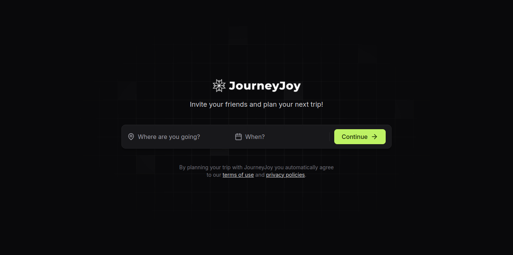
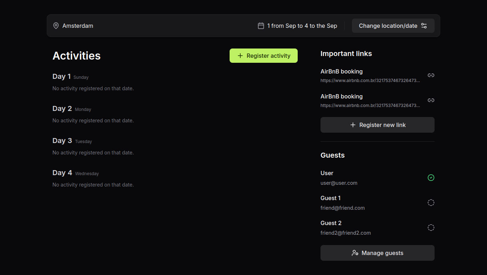

<p align="center">
  <h1 align="center"><a href="https://food-explorer-vasc-333.netlify.app/">JourneyJoy 🚗</a></h1>
</p>

> Status: Developed ✅

### Initial page:

### Trip details:


## About the project 📝

With Jorneyoy, you can plan your group trip and give all members access to the trip itinerary. You can also record the activities that will take place during the trip, categorized by date and time.

## Tools used in this project 🛠️

- [HTML](https://developer.mozilla.org/pt-BR/docs/Web/HTML)
- [CSS](https://developer.mozilla.org/pt-BR/docs/Web/CSS)
- [ReactJS](https://legacy.reactjs.org/docs/getting-started.html)
- [NodeJS](https://nodejs.org/en)
- [Prisma](https://www.prisma.io/)
- [Zod](https://zod.dev/)
- [Nodemailer](https://nodemailer.com/)
- [Fastify](https://fastify.dev/)
- [Axios](https://axios-http.com/docs/intro)

## How can I use it? 💻

### 1. Clone the project to your computer.

```bash
$ git clone git@github.com:holices/food-explorer
```

<br>

### 2. With the project open in an IDE, navigate to the API directory and run the commands:

```bash
# Install the packages needed to run the project
$ npm install
```

```bash
# Run the database
$ npm run dev
```

<br>

### 3. Now go back to the root directory and access the MYNOTES folder and run it:

```bash
# Install the packages needed to run the project
$ npm install
```

```bash
# Run the frontend
$ npm run dev
```

<br>

### 4. Now you're ready to go! 🎉

<br>

## Thank you in advance for any contribution!
